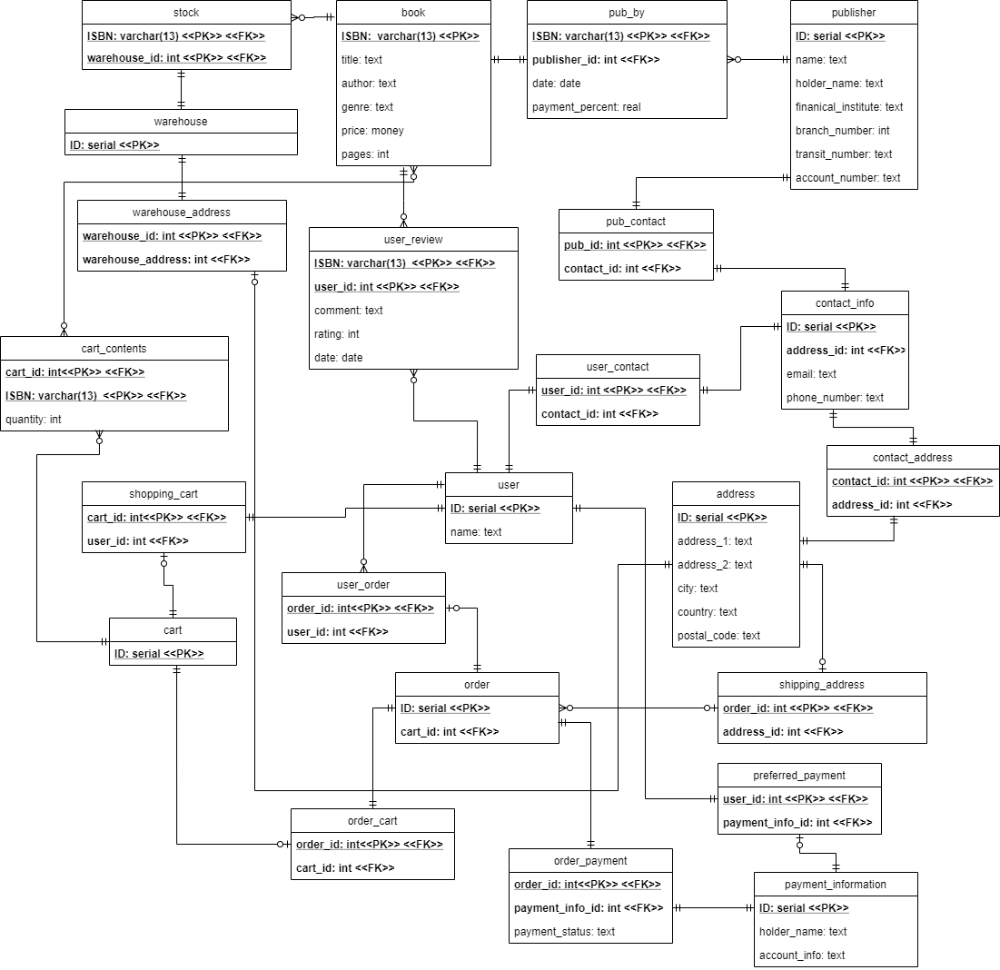

# COMP3005 Project Report

Andre Telfer
100880651

## Contents

[TOC]

## 1. Conceptual Design

## 2. Reduction to Relation Schema

We used a slightly different format from the one described in class, but the structure is the same and more details are provided.

- Note this a full 

## 3. Normalization of Relation Schemas

We used Third Normal Form (3NF)

### book

$$
\begin{align}
\text{let }A &= ISBN\\
\text{let }B &= title\\
\text{let }C &= author\\
\text{let }D &= genre\\
\text{let }E &= price\\
\text{let }F &= pages\\
\\
R &= (A, B, C, D, E, F, E, F) \\
\\
F &= \{ \\&A \rightarrow B, A \rightarrow C, A \rightarrow D, 
\\&A \rightarrow E, A \rightarrow F \\\} \\
\\

&& result &= A \\
\\
A &\rightarrow B &result &= AB \\
A &\rightarrow C &result &= ABC \\
A &\rightarrow D &result &= ABCD \\
A &\rightarrow E &result &= ABCDE \\
A &\rightarrow F &result &= ABCDEF \\
\end{align} \\
$$
Therefore ISBN is a superkey and this relation is in 3NF form

### publisher

$$
\begin{align}
\text{let }A &= ID\\
\text{let }B &= name\\
\text{let }C &= holder\_name\\
\text{let }D &= financial\_institute\\
\text{let }E &= branch\_number\\
\text{let }F &= transit\_number\\
\text{let }G &= account\_number\\
\\
R &= (A, B, C, D, E, F, E, F, G) \\
\\
F &= \{ \\&A \rightarrow B, A \rightarrow C, A \rightarrow D, 
\\&A \rightarrow E, A \rightarrow F, A \rightarrow G \\\}
\\

&& result &= A \\
\\
A &\rightarrow B &result &= AB \\
A &\rightarrow C &result &= ABC \\
A &\rightarrow D &result &= ABCD \\
A &\rightarrow E &result &= ABCDE \\
A &\rightarrow F &result &= ABCDEF \\
A &\rightarrow G &result &= ABCDEFG \\
\end{align} \\
$$

Therefore ID is a superkey and this relation is in 3NF form

### contact_info

$$
\begin{align}
\text{let }A &= ID\\
\text{let }B &= address_id\\
\text{let }C &= email\\
\text{let }D &= phone_number\\
\\
R &= (A, B, C, D) \\
\\
F &= \{ \\&A \rightarrow B, A \rightarrow C, A \rightarrow D\\\} \\
\\

&& result &= A \\
\\
A &\rightarrow B &result &= AB \\
A &\rightarrow C &result &= ABC \\
A &\rightarrow D &result &= ABCD \\
\end{align} \\
$$

Therefore ID is a superkey and this relation is in 3NF form

### Simple cases

1. The following relations have only two attributes and one functional dependency connecting them, giving a clear primary key showing that they are in 3NF form

   They can be tested with the following form

$$
\begin{align}
R &= AB \\
F &= \{A \rightarrow B\}\\
\\
&&& result = A \\
A &\rightarrow B && result=AB \\
\end{align}
$$

$\therefore$ for every functional dependency $\alpha\rightarrow \beta$ in $F_c$, $\alpha$ is a superkey

- user
- user_contact
- order_cart
- user_order
- pub_contact
- contact_address
- preferred_payment
- warehouse_address
- shipping_address
- stock

2. Another simple case are entities with one attribute 

- cart
- warehouse

## 4. 

...